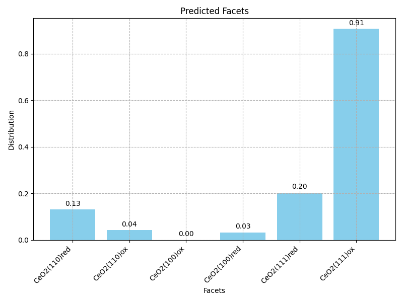
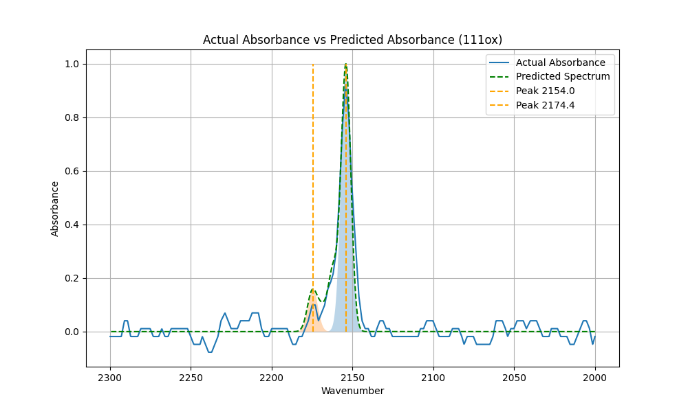

<!DOCTYPE html>
<html lang="en">
<head>
    <meta charset="UTF-8">
    <title>README: Spectroscopy Prediction Models</title>
</head>
<body>

<h1>README: Spectroscopy Prediction Models</h1>

<h2>Overview</h2>

This repository contains Python scripts for generating synthetic spectroscopy data and predicting material facets using CNN and DNN models. The models are designed to understand and predict material properties from their infrared spectroscopy data.

<h2>Files Description</h2>
<ul>
    <li><code>generatesynthetic_cnn.py</code> - For generating synthetic spectra data and predicting with CNN.</li>
    <li><code>generatesysnthetic_dnn.py</code> - Similar to the CNN script, but uses a DNN model for predictions.</li>
    <li><code>facetprediction_experiment.py</code> - Uses a pre-trained CNN for predicting material facets from spectroscopy data.</li>
</ul>

<h2>Plots</h2>
<figure>
    
    <figcaption>Fig.1 - Predicted distribution of CeO2 facets. The bar chart shows the model's prediction with the highest prevalence for CeO2(111)ox.</figcaption>
</figure>
<figure>
    
    <figcaption>Fig.2 - Actual vs Predicted Absorbance for the CeO2(111)ox facet. The line graph illustrates the comparison of actual and predicted spectra with peaks at 2154.0 and 2174.4 wavenumbers.</figcaption>
</figure>

<h2>Requirements</h2>

Ensure you have the following dependencies installed:

<pre>
<code>
pip install tensorflow numpy pandas matplotlib scikit-learn
</code>
</pre>

<h2>Usage</h2>

To run the scripts:

<pre>
<code>
python generatesynthetic_cnn.py
python generatesysnthetic_dnn.py
python facetprediction_experiment.py
</code>
</pre>

<h2>Note</h2>

The scripts are prepared for Google Colab, adjustments are necessary for other environments.

<h2>Contribution</h2>

Contributions to improve the models or extend the datasets are welcome. Please submit a pull request or raise an issue.

</body>
</html>
